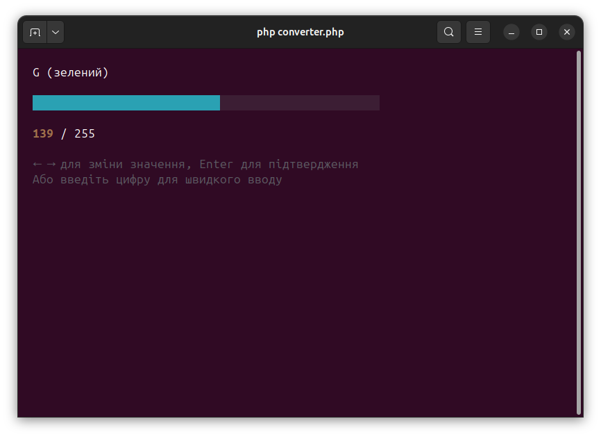

# PHP Color Converter

A standalone, interactive command-line tool for converting color models, written in pure PHP.

## Features

- **Multiple Conversion Modes:** Convert between RGB, CMYK, and HSV.
- **Interactive UI:** A fully interactive, menu-driven interface that runs directly in your terminal.
- **Live Previews:** See a preview of the color swatch in your terminal as you select values.
- **Slider Input:** Use arrow keys to intuitively adjust color values with a visual slider.
- **Conversion History:** Keeps a running history of your recent color conversions.
- **Zero Dependencies:** A single script that runs without any external libraries or Composer packages.

## How to Run

1.  Ensure you have PHP installed.
2.  Run the script from your terminal:
    ```bash
    php converter.php
    ```

## Usage

This tool provides a simple, guided workflow for color conversion. First, run the script to see the main menu where you can select the desired conversion type.


Next, use the arrow keys to adjust the color values with the interactive slider. The terminal shows a live preview of the color as you make changes.



After confirming your input, the script will display the final conversion result.


